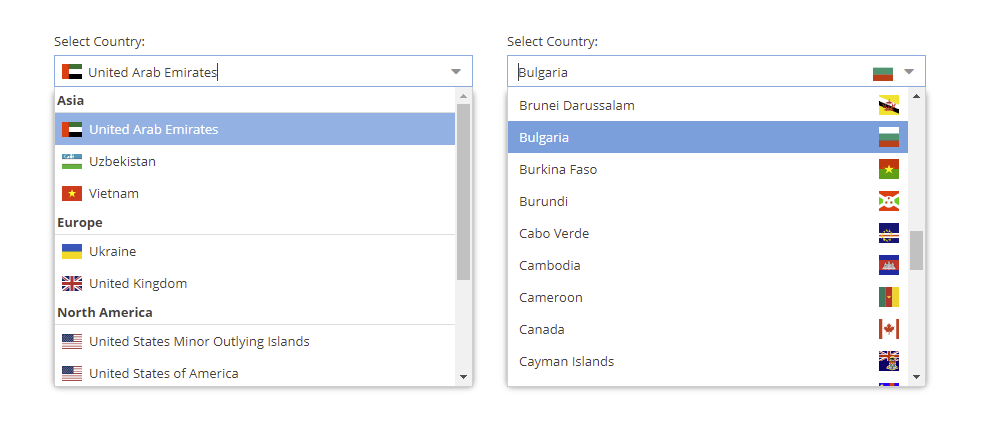

Combobox form field with SVG flags for selecting countries for Sencha ExtJS / classic toolkit
-------------------------------------



**Source at GitHub**

[https://github.com/wencywww/Ext.ux.form.field.FlagsCountryCombo](https://github.com/wencywww/Ext.ux.form.field.CountryFlagCombo)


**Demos**

[Sencha's Fiddle: https://fiddle.sencha.com/#fiddle/3fmv](https://fiddle.sencha.com/#fiddle/3fmv)


**Features:**

  * Can be used as a standard form field everywhere when a country has to be selected within the application
  * **NO EXTERNAL FILES NEEDED** - css/svg data is included in the component, so only the JS source file needs to be included in the project
  * SVG data provided by the [flag-icons project](https://flagicons.lipis.dev), optimized by [SVGO](https://github.com/svg/svgo) tool
  * Extends the Sencha's ExtJS [Ext.form.field.ComboBox](https://docs.sencha.com/extjs/7.4.0/classic/Ext.form.field.ComboBox.html); registers the **'countrycombo'** xtype
  * Built-in data for 251 countries, including country names, [ISO 3166-1-alpha-2 codes](https://www.iso.org/obp/ui/#search/code), and SVG data for country flags
  * Flags supported in 2 proportions, 4x3 and 1x1
  * Flags can be rendered on the left or right side
  * Flags can be rendered within both the dropdown list/input field or only within the dropdown.
  * If desired - they can be turned off entirely (the combo will show only country names)
  * The dropdown supports **grouping by country regions** in which case the combo becomes grouped combo
  * Independant **templates** for fine-tuning the contents of the dropdown list/input field
  * Supports **filtering by region and country name/code** - the instance store thus can include only a subset of the data
  * Supports all the ExtJS classic toolkit **themes**, specially crafted CSS is created depending on the currently active theme - test it on the [Sencha Fiddle](https://fiddle.sencha.com/#fiddle/3fmv) link above
  * Supports **multiple instances** on a single page, all of them with independant configurations (the instance stores are created on the fly sharing the hard-coded prototype data)
  * Tested with ExtJS version 4.1.1 and up to 7.4.0


**Cons:**

  * Relativelty large file size, with all SVG data it is ~ 2.5 MB after SVGO optimizations

    
**Configuration options**

  * All configs below are optional, defaults are applied if not provided
  * Instance store fields are `id, zone, code, and name`
  * By default, value/display fields are `valueField: 'code', displayField: 'name'`
  * Default options (without `componentConfig` provided) include all countries, sorted by name, with 4x3 flags placed on the left in the dropdown list items and the input field. No grouping by regions by default.
  * Component configs are set within the **componentConfig** instance property (it should be an object with the following properies):
  

  * **flags** `(boolean, default: true)`: Turns country flags on/off

  * **flagsSize** `(string, default: '4x3')`: Flags render proportions, **'4x3'** for rectangle or **'1x1'** for square

  * **flagsPosition** `(string, default: 'left')`: Flags alignment for both input field/dropdown list, 'left' or 'right'

  * **flagOnInput** `(boolean, default: true)`: Turns country flag on/off - only for the input field

  * **zoneGroups** `(boolean, default: false)`: Turns country grouping by world regions on/off within the dropdown list. Region grouping is visual and independant from zone filtering below.

  * **filterZones** `(boolean|array of strings, default: false)`: Filters combo store by country region. Regions available are: Antarctica, Africa, Asia, Europe, North America, South America and Oceania. Filtering is case insensitive. The filtering mode is determined by the `filterZonesMode` config

  * **filterZonesMode** `(string, default: 'include')`: Determines how the countries are filtered by their regions. If 'include', the instance store will contain only countries in regions available in the `filterZones` array. If 'exclude', the appropriate countries will be excluded from the store

  * **filterCountries** `(boolean|array of strings, default: false)`: Filters combo store by **country name** or **country code** (codes and names can be mixed and are case insensitive). The filtering mode is determined by `filterCountriesMode` config

  * **filterCountriesMode** `(string, default: 'include')`: Determines how the countries are filtered by their names/codes. If 'include' the instance store will contain only countries available in the `filterCountries` array. If 'exclude', the matching countries will be excluded from the store

    **Note:**
    
    The filtering options can be used simultaneously. In such cases, the region conditions are applied first, and then country filters are applied to the resulting countries. For example, the following config will include only countries in Asia and Oceania, but without Mongolia, China and Australia: 
    ```
    componentConfig: {
        filterZones: ['Asia', 'Oceania'], 
        filterZonesMode: 'include', 
        filterCountries: ['cn', 'Mongolia', 'Australia'], 
        filterCountriesMode: 'exclude'
    }
    ```

  * **listItemTpl** `(string, default: '{' + displayField + '}')`: XTemplate compatible string for fine-tuning the appearance of the dropdown list items. Available store fields are {id}, {zone}, {code}, {name}. To get the region name, use the **getZoneName()** template member function - for example `listItemTpl: '{name} / {[this.getZoneName(values.zone)]}` will place the region name after the country name, separated by a slash like this: Bulgaria / Europe. This is because the {zone} field contains only a zone number

  * **displayTpl** `(string, default: null)`: Same as `listItemTpl`, but html tags are not supported, they will be included as a plain text within the input field

  * **listClsLeft / listClsRight** `(string, default: 'flag-combo-bg-list / flag-combo-bg-list-right')`: The CSS class name that will be generated for styling the dropdown list items when flags are places to the left/right respectively

  * **inputClsLeft / inputClsRight** `(string, default: 'flag-combo-bg-input / flag-combo-bg-input-right')`: The CSS class name that will be generated for styling the combo input element when flags are places to the left/right respectively

  * **groupHeaderCls** `(string, default: 'flag-combo-group-header')`: The CSS class name that will be generated for styling the region names header elements when the dropdown list items are grouped using `zoneGroups: true`

  
**Usage**

  * Include the `src/FlagsCountryComboBox.js` in you project file (Ext must be included prior to this)
  * Instantiate the class, for example `var myCountryCombo = Ext.create('Ext.ux.form.field.FlagsCountryComboBox')`, or using the **'countrycombo'** xtype like this: `Ext.widget('countrycombo', {componentConfig: {...config-options-here...}});`
  

**List of Changes**

  * **2021-09-02**, initial commit
